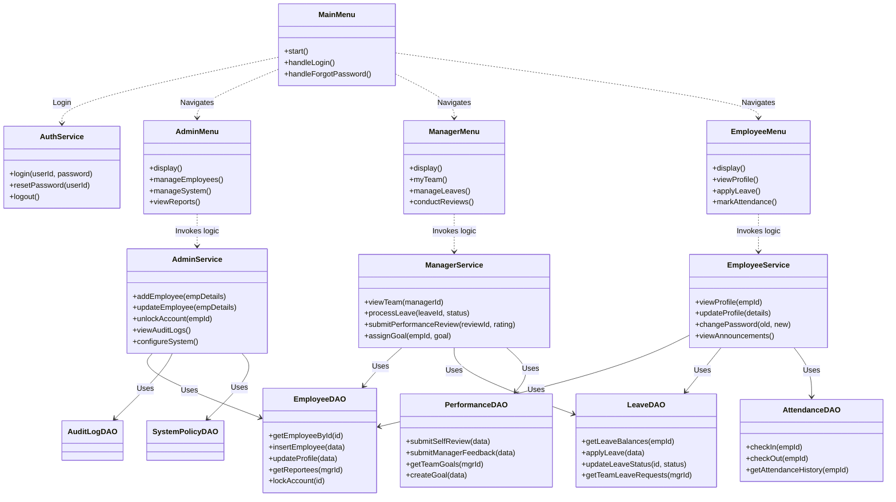
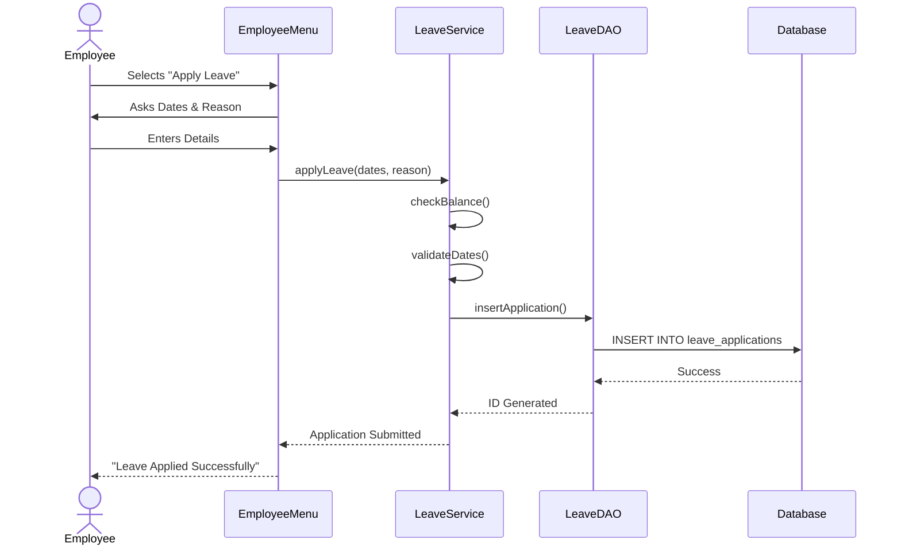
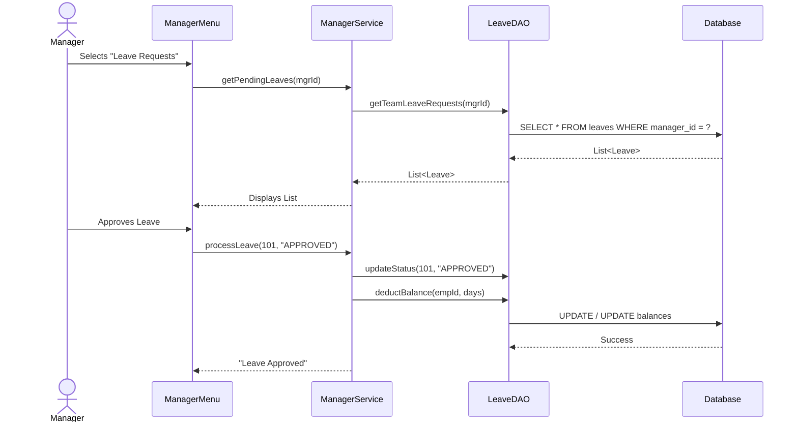

# System Architecture Documentation

This document provides a detailed breakdown of the RevWorkForce system architecture, analyzing every class, its role, and key operations.

## 🏛 Application Overview
RevWorkForce follows a **Layered Architecture** pattern, ensuring separation of duties between User Interaction (Menus), Business Logic (Services), and Data Persistence (DAOs).

---

## 🧩 Detailed Class Roles & Responsibilities

### 1. Presentation Layer (Menus)
Files located in `com.revworkforce.menu` handle all user inputs and console display logic.

| Class | Role | Key Operations |
| :--- | :--- | :--- |
| **`MainMenu`** | **Entry Point** | • Application Bootstrap (`main` calls `start()`) • User Login / Session Creation • Password Recovery Flow |
| **`AdminMenu`** | **Admin UI** | • Employee CRUD Interface • System Configuration Menus • Audit Log Viewer |
| **`ManagerMenu`** | **Manager UI** | • Team Dashboard • Leave Approval Console • Performance Review Interface |
| **`EmployeeMenu`** | **Employee UI** | • Self-Service Portal • Leave Application Form • Attendance Marking • Profile Updates |

### 2. Service Layer (Business Logic)
Files in `com.revworkforce.service` contain the core business rules, validations, and transaction orchestration.

| Class | Role | Key Operations |
| :--- | :--- | :--- |
| **`AuthService`** | **Security** | • **`login()`**: Validates credentials using BCrypt. • **`logout()`**: Clears `SessionContext`. • **`forcePasswordReset()`**: Triggers flow for first-time users. |
| **`AdminService`** | **Admin Logic** | • **`addEmployee()`**: Validates unique email/phone, generates ID, calls DAO. • **`unlockAccount()`**: Resets failed login counters. • **`configureLeaveTypes()`**: Adds new leave categories dynamically. |
| **`ManagerService`** | **Manager Logic** | • **`viewTeam()`**: Fetches hierarchy-based reportee list. • **`processLeave()`**: Validates permissions before approving leaves. • **`submitReview()`**: Calculates final ratings and commits feedback. |
| **`EmployeeService`** | **User Logic** | • **`viewProfile()`**: Fetches sensitive data only for the owner. • **`viewBirthday()`**: Employee engagement features. • **`changePassword()`**: Enforces password complexity policies. |
| **`LeaveService`** | **Leave Logic** | • **`calculateDuration()`**: Accounts for weekends/holidays. • **`checkBalance()`**: Ensures sufficient quota before application. |
| **`AuditService`** | **Auditing** | • **`logAction()`**: Asynchronously writes events to `AUDIT_LOGS` table. |

### 3. Data Access Layer (DAOs)
Files in `com.revworkforce.dao` handle direct database interactions using JDBC. All SQL queries are parameterized to prevent Injection.

| Class | Role | Key Operations |
| :--- | :--- | :--- |
| **`EmployeeDAO`** | **User Data** | • `SELECT` by ID/Email • `INSERT` new hires • `UPDATE` passwords & profile fields. |
| **`LeaveDAO`** | **Leave Data** | • Manage `LEAVE_BALANCES` and `LEAVE_APPLICATIONS`. • Transactional integrity during balance updates. |
| **`PerformanceDAO`** | **Reviews** | • CRUD for `PERFORMANCE_REVIEWS` and `GOALS`. • Aggregation queries for team performance stats. |
| **`AuditLogDAO`** | **Logging** | • Insert-only operations for security logs. • Read-only access for Admin reports. |
| **`DBConnection`** | **Infrastructure** | • Manages JDBC Connection Pool (Singleton pattern). |

### 4. Utilities & Context
Cross-cutting concerns used throughout the application.

| Class | Role | Key Operations |
| :--- | :--- | :--- |
| **`SessionContext`** | **State** | • Stores currently `loggedInUser` object. • Provides global access to current user identity. |
| **`PasswordUtil`** | **Security** | • `hash()`: Generates BCrypt hash. • `check()`: Verifies plain text against hash. |
| **`ValidationUtil`** | **Helpers** | • Regex checks for Email, Phone, and Date formats. |

---

## 🔄 Interaction Flow Examples

### A. Leave Application Flow

### B. Manager Approval Flow

