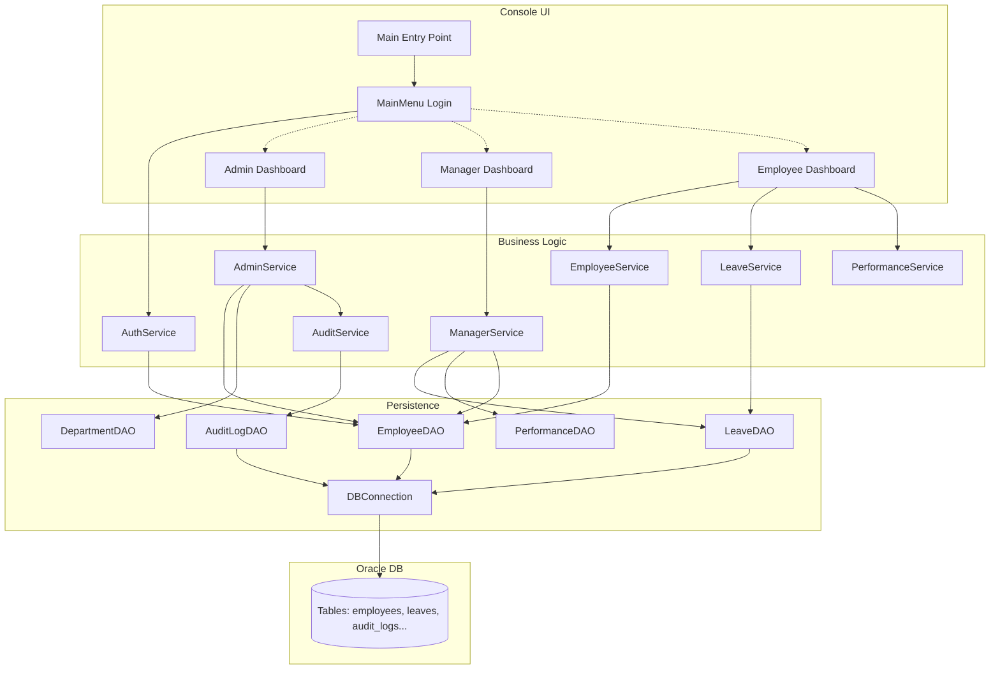
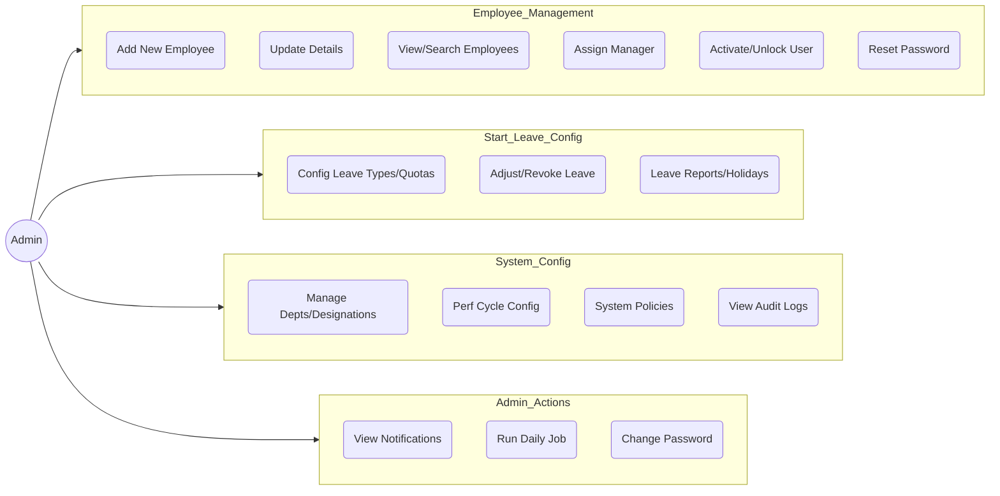
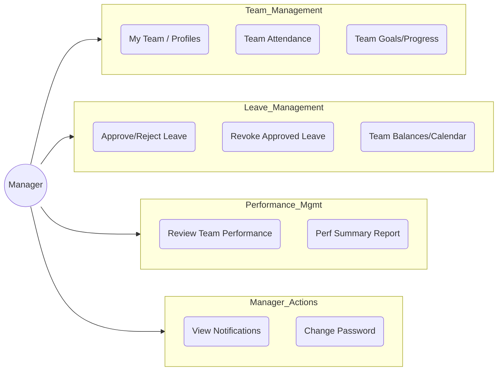
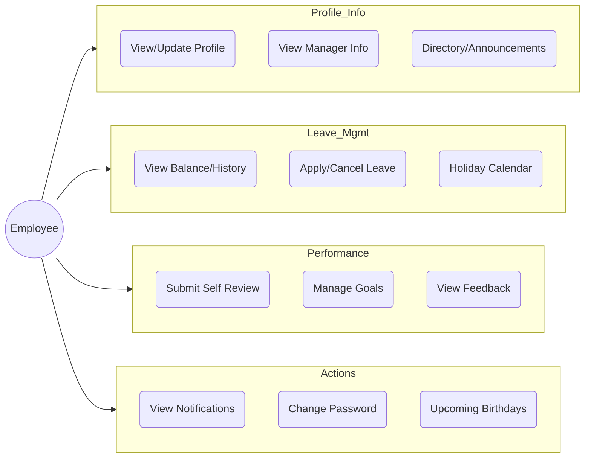

# RevWorkForce Design Documentation

## 1. Architecture Overview
The application follows a standard layered architecture for a Java Console Application, utilizing the DAO (Data Access Object) pattern for database interactions.

### Architecture Diagram

## 2. Use Case Diagrams

### 2.1 Admin Use Cases

### 2.2 Manager Use Cases

### 2.3 Employee Use Cases

## 3. Class Roles & Responsibilities

### Presentation Layer (Menus)
| Class | Responsibility |
|-------|----------------|
| `Main` | Application entry point. Initializes DB connection and acts as the bootstrap. |
| `MainMenu` | Handles initial user authentication (Login, Forgot Password) and routes users to their role-specific dashboard. |
| `AdminMenu` | UI for Administrators. Provides options for system configuration, employee onboarding, and audit viewing. |
| `ManagerMenu` | UI for Managers. Focuses on team oversight, leave approvals, and performance reviews. |
| `EmployeeMenu` | UI for standard Employees. Allows profile viewing, leave application, and self-performance tracking. |

### Service Layer (Business Logic)
| Class | Responsibility |
|-------|----------------|
| `AuthService` | Manages authentication, session handling, password hashing/verification, and account locking. |
| `AdminService` | Aggregates admin operations: onboarding employees, managing master data (departments, designations), and viewing system logs. |
| `ManagerService` | Logic for team management: fetching direct reports, processing leave requests, and handling performance reviews. |
| `EmployeeService` | basic employee operations: profile view/update, password change, and directory search. |
| `LeaveService` | Manages leave logic: applying for leave, calculating balances, and validating dates. |
| `PerformanceService`| Handles the performance review cycle, self-reviews, and goal management. |
| `AuditService` | Centralized service for logging critical system actions to the `audit_logs` table. |
| `NotificationService`| Manages system alerts and notifications (birthdays, leave status updates). |

### Data Access Layer (DAO)
| Class | Responsibility |
|-------|----------------|
| `EmployeeDAO` | CRUD operations for `employees` table. Handles profile fetching and credential verification. |
| `LeaveDAO` | CRUD operations for `leave_applications` and `leave_balances`. |
| `AuditLogDAO` | Inserts and reads from `audit_logs`. |
| `DepartmentDAO` | Manages `departments` master data. |
| `DesignationDAO`  | Manages `designations` master data. |
| `PerformanceDAO` | Handles `performance_reviews` and `goals`. |
| `DBConnection` | Manages the JDBC connection to the Oracle database. |

## 4. Detailed User Flows

### A. Admin Flow: Adding a New Employee
**Scenario:** An Admin logs in and onboards a new hire.

1.  **Start:** Admin selects "Add New Employee" from `AdminMenu`.
2.  **Input:** System prompts for:
    *   Manager Status (creates ID prefix `MGR` or `EMP`) -> Generates unique ID (e.g., `EMP005`).
    *   Personal Details: Name, Email, Phone, Address.
    *   **Validation:** Service checks if Email/Phone already exists using `EmployeeDAO`.
    *   Professional Details: Department, Designation, Manager ID, Salary.
    *   **Validation:** Verifies referenced IDs exist.
3.  **Processing:**
    *   `AdminService` generates a default password hash (default: "password").
    *   Calls `EmployeeDAO.insertEmployee()`.
    *   Calls `AuditService.log()` to record the "CREATE" action.
4.  **End:** Success message displayed. Employee can now log in.

### B. Manager Flow: Approving Leave
**Scenario:** A Manager reviews and approves a pending leave request from a direct report.

1.  **Start:** Manager selects "Manage Leave Requests" from `ManagerMenu`.
2.  **View:** System calls `ManagerService.viewTeamLeaveRequests()`.
    *   `LeaveDAO` fetches requests where `emp_id` is in the manager's team AND status is `PENDING`.
3.  **Action:** Manager enters the `Leave ID` to process.
    *   System validates the ID belongs to their team.
4.  **Decision:** Manager chooses Access (A) or Reject (R) and enters comments.
5.  **Processing:**
    *   `ManagerService.processLeave()` is called.
    *   Updates leave status in DB via `LeaveDAO`.
    *   Calls `NotificationService` to alert the employee.
    *   Calls `AuditService.log()` to record the decision.
6.  **End:** Success message displayed.

### C. Employee Flow: Applying for Leave
**Scenario:** An employee applies for sick leave.

1.  **Start:** Employee selects "Apply for Leave" from `EmployeeMenu`.
2.  **Input:**
    *   Leave Type ID (e.g., 1 for Sick Leave).
    *   Start Date and End Date.
    *   Reason.
3.  **Validation:** `LeaveService` checks if End Date is after Start Date.
4.  **Processing:**
    *   `LeaveService.applyLeave()` is called.
    *   `LeaveDAO` inserts a new record with status `PENDING`.
    *   Calls `AuditService.log()` to record the application.
5.  **End:** Success message "Leave applied successfully. Status: PENDING".
