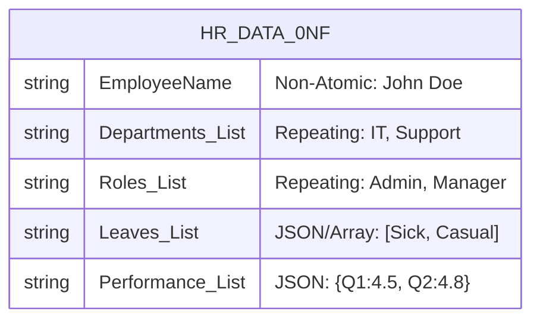
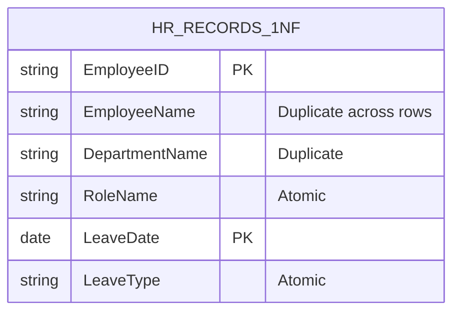
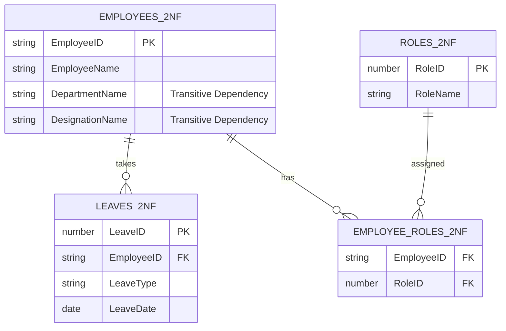

# Database Schema Documentation

This document visualizes the complete database structure for RevWorkForce using a Mermaid Entity Relationship Diagram (ERD).

## Database Normalization Journey

This schema was designed following the principles of database normalization to ensure data integrity and reduce redundancy. Here is the process we followed:

### 1. 0NF (Unnormalized Form)
**Definition**: A flat structure with repeating groups and non-atomic values.
*   **Initial State**: A single massive `HR_DATA` spreadsheet containing everything for an employee in one row.
*   **Example**:
    | Employee Name | Departments | Roles | Leaves Taken | Performance |
    | :--- | :--- | :--- | :--- | :--- |
    | John Doe | IT, Support | Admin, Manager | [Sick: 2023-01-01, Casual: 2023-05-12] | {Q1: 4.5, Q2: 4.8} |
*   **Issues**: Data redundancy, difficult to query (e.g., "Find all employees with Sick leave"), inconsistency in data entry.

### 2. 1NF (First Normal Form)
**Definition**: Eliminate repeating groups; ensure atomicity (one value per cell).
*   **Transformation**: We split the multi-valued columns (`Roles`, `Leaves`, `Performance`) into separate rows.
*   **State**: 
    *   If John Doe has 2 roles and 3 leaves, he appears in 6 rows.
    *   Columns: `EmpID`, `Name`, `Dept`, `Role`, `LeaveDate`, `LeaveType`.
*   **Issues**: Massive data duplication. John's personal details (Name, Address) are repeated for every single leave application or role assignment.

### 3. 2NF (Second Normal Form)
**Definition**: Must be in 1NF, and allow no **Partial Dependencies**. All non-key attributes must depend on the *entire* Primary Key.
*   **Transformation**:
    *   In the 1NF table (Composite Key: `EmpID` + `LeaveID`), `EmployeeName` depends only on `EmpID` (part of the key), not `LeaveID`. This is a partial dependency.
    *   **Action**: We split the data into separate tables based on primary entities:
        *   `EMPLOYEES` (EmpID, Name, Dept, Desg)
        *   `LEAVES` (LeaveID, EmpID, Type, Date)
        *   `ROLES` (RoleID, Name)
        *   `EMPLOYEE_ROLES` (EmpID, RoleID) - Junction table.
*   **Issues**: Transitive Dependencies still exist.
    *   In `EMPLOYEES` table, we might have `DepartmentName` and `DesignationName`.
    *   `DepartmentName` depends on `DepartmentID` (which depends on `EmpID`). This is transitive.

### 4. 3NF (Third Normal Form) - *Current State*
**Definition**: Must be in 2NF, and allow no **Transitive Dependencies**. Non-key attributes must depend *only* on the Primary Key.
*   **Transformation**:
    *   We identified attributes that don't directly describe the Employee but describe another entity referenced by the Employee.
    *   **Action**:
        *   Moved `DepartmentName` out of `EMPLOYEES` to a new `DEPARTMENTS` table.
        *   Moved `DesignationName` out of `EMPLOYEES` to a new `DESIGNATIONS` table.
        *   Moved `LeaveTypeName` out of `LEAVE_APPLICATIONS` into `LEAVE_TYPES`.
*   **Result**: The schema below is fully normalized to 3NF. Every piece of data is stored in exactly one place (except for Foreign Keys), ensuring consistency and update efficiency.

## Entity Relationship Diagram (ERD)

```mermaid
erDiagram

    EMPLOYEES {
        VARCHAR2 employee_id PK
        VARCHAR2 first_name
        VARCHAR2 last_name
        VARCHAR2 email UK
        VARCHAR2 phone
        VARCHAR2 address
        VARCHAR2 emergency_contact
        DATE date_of_birth
        NUMBER department_id FK
        NUMBER designation_id FK
        VARCHAR2 manager_id FK
        DATE joining_date
        NUMBER salary
        VARCHAR2 password_hash
        NUMBER is_active
        TIMESTAMP created_at
        TIMESTAMP updated_at
    }

    DEPARTMENTS {
        NUMBER department_id PK
        VARCHAR2 department_name UK
        TIMESTAMP created_at
        TIMESTAMP updated_at
    }

    DESIGNATIONS {
        NUMBER designation_id PK
        VARCHAR2 designation_name
        TIMESTAMP created_at
        TIMESTAMP updated_at
    }

    ROLES {
        NUMBER role_id PK
        VARCHAR2 role_name UK
        TIMESTAMP created_at
    }

    EMPLOYEE_ROLES {
        NUMBER employee_role_id PK
        VARCHAR2 employee_id FK
        NUMBER role_id FK
        TIMESTAMP created_at
    }

    LEAVE_TYPES {
        NUMBER leave_type_id PK
        VARCHAR2 leave_type_name UK
        VARCHAR2 description
        TIMESTAMP created_at
    }

    LEAVE_BALANCES {
        NUMBER leave_balance_id PK
        VARCHAR2 employee_id FK
        NUMBER leave_type_id FK
        NUMBER year
        NUMBER total_allocated
        NUMBER used_leaves
        NUMBER available_leaves
        TIMESTAMP created_at
        TIMESTAMP updated_at
    }

    LEAVE_APPLICATIONS {
        NUMBER leave_application_id PK
        VARCHAR2 employee_id FK
        NUMBER leave_type_id FK
        DATE start_date
        DATE end_date
        NUMBER total_days
        VARCHAR2 reason
        VARCHAR2 status
        VARCHAR2 manager_comments
        TIMESTAMP applied_date
        TIMESTAMP reviewed_date
        VARCHAR2 reviewed_by FK
        TIMESTAMP created_at
        TIMESTAMP updated_at
    }

    HOLIDAYS {
        NUMBER holiday_id PK
        VARCHAR2 holiday_name
        DATE holiday_date
        NUMBER year
        TIMESTAMP created_at
    }

    ATTENDANCE {
        NUMBER attendance_id PK
        VARCHAR2 employee_id FK
        DATE attendance_date
        TIMESTAMP check_in_time
        TIMESTAMP check_out_time
        VARCHAR2 status
        TIMESTAMP created_at
    }

    PERFORMANCE_CYCLES {
        NUMBER cycle_id PK
        NUMBER year UK
        DATE start_date
        DATE end_date
        VARCHAR2 status
        TIMESTAMP created_at
    }

    PERFORMANCE_REVIEWS {
        NUMBER review_id PK
        VARCHAR2 employee_id FK
        NUMBER cycle_id FK
        CLOB key_deliverables
        CLOB major_accomplishments
        CLOB areas_of_improvement
        NUMBER self_assessment_rating
        CLOB manager_feedback
        NUMBER manager_rating
        VARCHAR2 status
        TIMESTAMP submitted_date
        TIMESTAMP reviewed_date
        VARCHAR2 reviewed_by FK
        TIMESTAMP created_at
        TIMESTAMP updated_at
    }

    GOALS {
        NUMBER goal_id PK
        VARCHAR2 employee_id FK
        NUMBER cycle_id FK
        VARCHAR2 goal_description
        DATE deadline
        VARCHAR2 priority
        VARCHAR2 success_metrics
        NUMBER progress_percentage
        VARCHAR2 status
        VARCHAR2 manager_comments
        TIMESTAMP created_at
        TIMESTAMP updated_at
    }

    ANNOUNCEMENTS {
        NUMBER announcement_id PK
        VARCHAR2 title
        CLOB content
        VARCHAR2 posted_by FK
        TIMESTAMP posted_date
        TIMESTAMP created_at
    }

    NOTIFICATIONS {
        NUMBER notification_id PK
        VARCHAR2 employee_id FK
        VARCHAR2 notification_type
        VARCHAR2 message
        NUMBER is_read
        TIMESTAMP created_at
        TIMESTAMP read_at
    }

    SECURITY_QUESTIONS {
        NUMBER question_id PK
        VARCHAR2 question_text
    }

    EMPLOYEE_SECURITY {
        NUMBER employee_security_id PK
        VARCHAR2 employee_id FK
        NUMBER question_id FK
        VARCHAR2 answer_hash
        TIMESTAMP created_at
    }

    SYSTEM_POLICIES {
        NUMBER policy_id PK
        VARCHAR2 policy_name UK
        CLOB policy_value
        TIMESTAMP created_at
        TIMESTAMP updated_at
    }

    AUDIT_LOGS {
        NUMBER log_id PK
        VARCHAR2 employee_id FK
        VARCHAR2 action
        VARCHAR2 table_name
        VARCHAR2 record_id
        CLOB old_value
        CLOB new_value
        VARCHAR2 ip_address
        TIMESTAMP created_at
    }

    %% Relationships
    EMPLOYEES ||--o{ EMPLOYEE_ROLES : has
    ROLES ||--o{ EMPLOYEE_ROLES : assigned

    DEPARTMENTS ||--o{ EMPLOYEES : contains
    DESIGNATIONS ||--o{ EMPLOYEES : assigns
    EMPLOYEES ||--o{ EMPLOYEES : manages

    EMPLOYEES ||--o{ LEAVE_APPLICATIONS : applies
    LEAVE_TYPES ||--o{ LEAVE_APPLICATIONS : categorized

    EMPLOYEES ||--o{ LEAVE_BALANCES : owns
    LEAVE_TYPES ||--o{ LEAVE_BALANCES : tracked

    EMPLOYEES ||--o{ ATTENDANCE : marks

    PERFORMANCE_CYCLES ||--o{ PERFORMANCE_REVIEWS : governs
    PERFORMANCE_CYCLES ||--o{ GOALS : defines

    EMPLOYEES ||--o{ PERFORMANCE_REVIEWS : reviewed
    EMPLOYEES ||--o{ GOALS : sets

    EMPLOYEES ||--o{ NOTIFICATIONS : receives
    EMPLOYEES ||--o{ ANNOUNCEMENTS : posts

    SECURITY_QUESTIONS ||--o{ EMPLOYEE_SECURITY : used_in
    EMPLOYEES ||--o{ EMPLOYEE_SECURITY : secures

    EMPLOYEES ||--o{ AUDIT_LOGS : generates
```

## Table Descriptions

*   **EMPLOYEES**: Core user table. Contains authentication details and profile info. Self-referencing FK `manager_id` builds the reporting hierarchy.
*   **LEAVE_BALANCES**: Tracks leave quotas per year. Composite logic often involves `(employee_id, leave_type_id, year)`.
*   **AUDIT_LOGS**: Immutable record of all critical changes for security and compliance.
*   **SYSTEM_POLICIES**: Key-value store for global configurations (e.g., `MAX_LOGIN_ATTEMPTS = 3`).
*   **PERFORMANCE_CYCLES**: Defines the active review period (e.g., "Q1 2024") to group reviews and goals.
