# Use Case & Control Flow Documentation

## 1. Use Case Diagrams (by Role)

### 1.1 Admin Use Cases
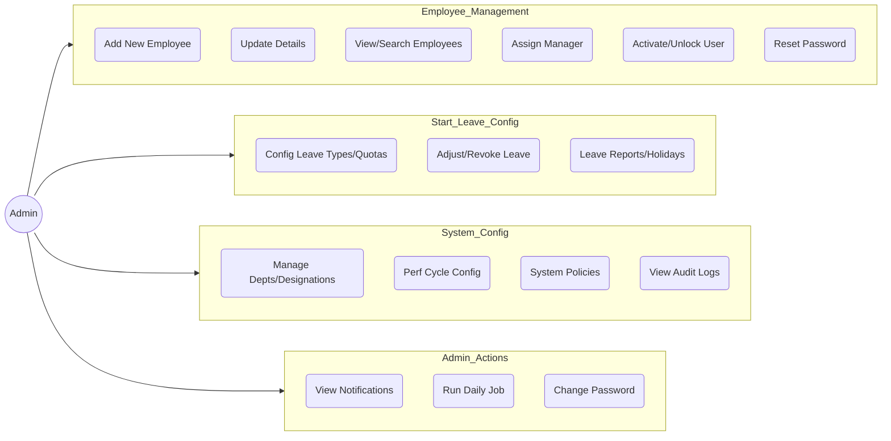

### 1.2 Manager Use Cases
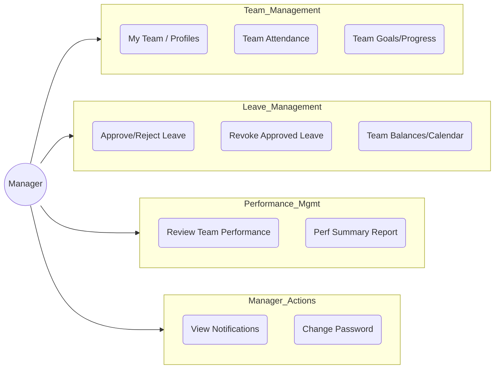

### 1.3 Employee Use Cases
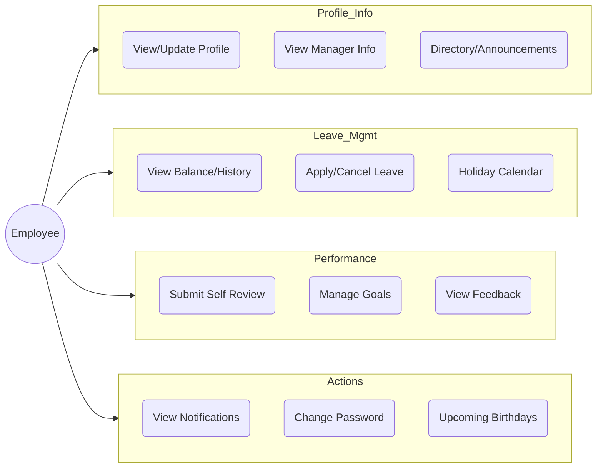

---

## 2. Detailed Control Flows (Interaction Logic)

### 2.1 Login Control Flow
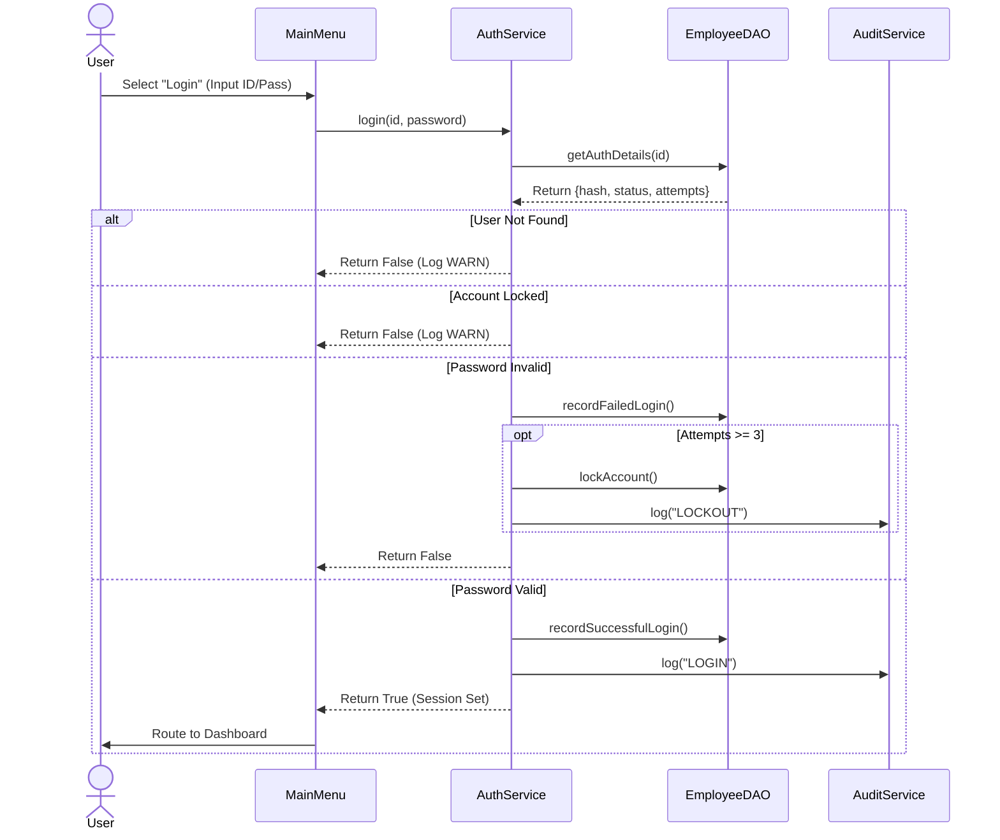

### 2.2 Leave Application Control Flow
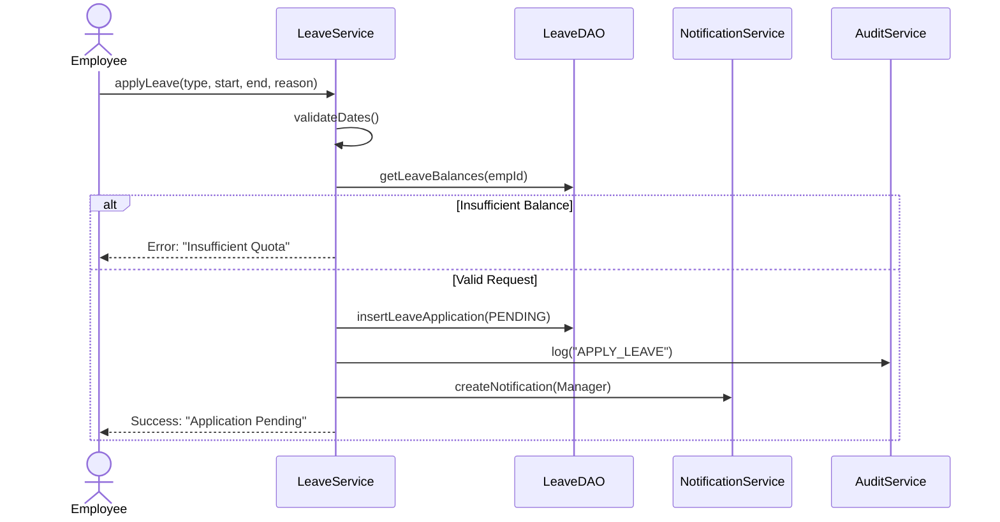

### 2.3 Leave Approval Control Flow
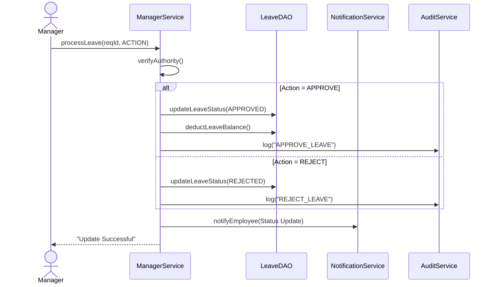

### 2.4 Performance Review Control Flow
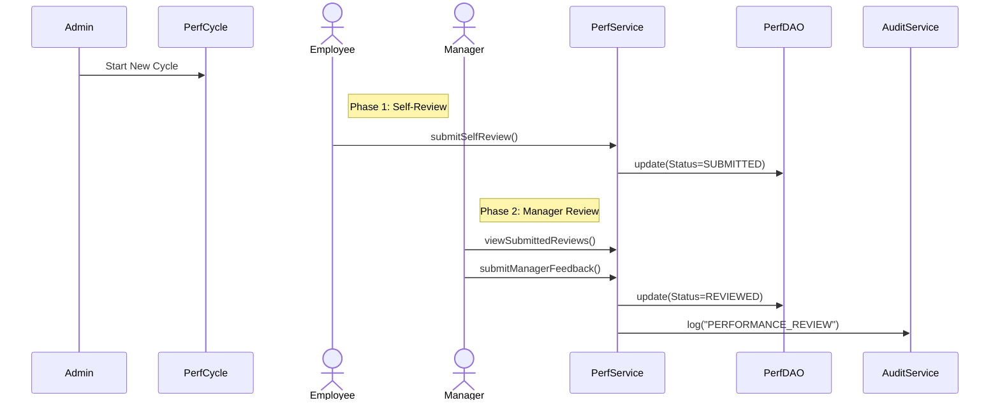

### 2.5 Audit Logging System Flow
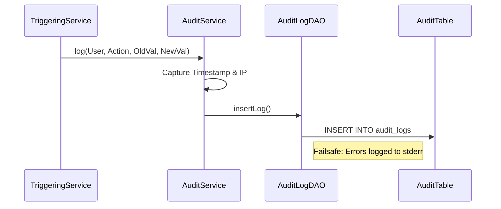

### 2.6 Employee Onboarding Flow (Admin)
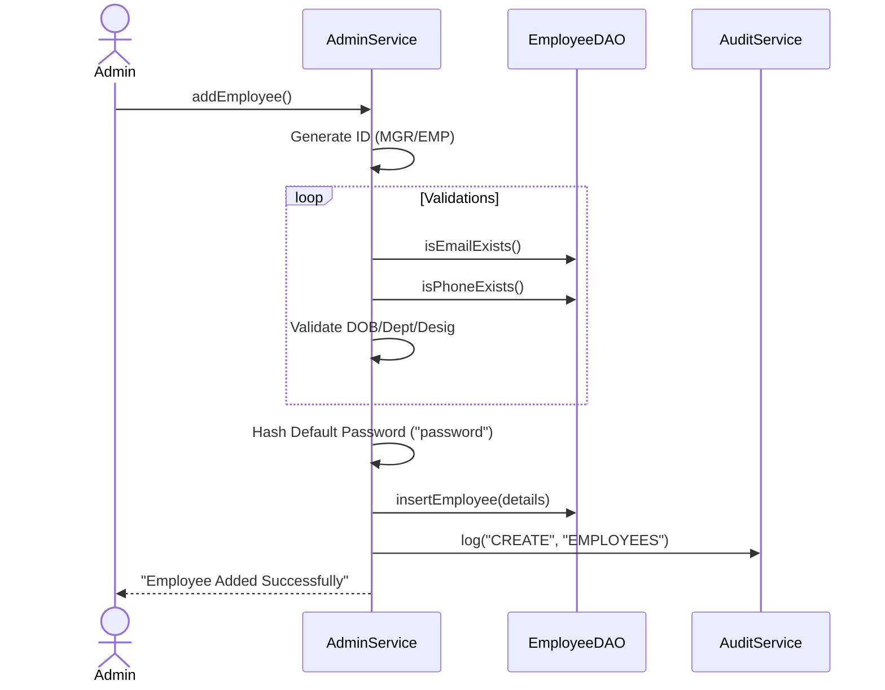

### 2.7 Attendance Check-In Flow
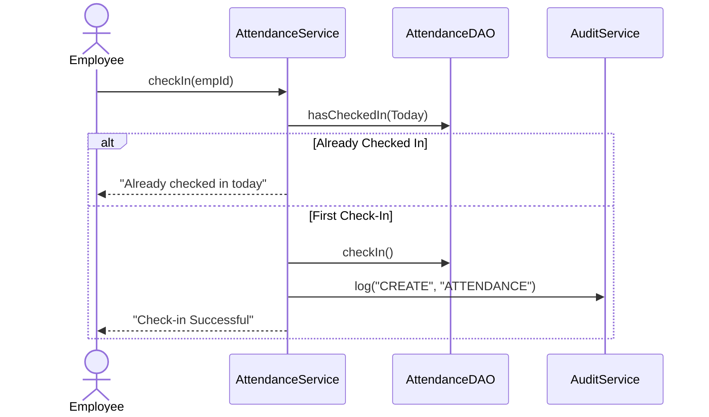

### 2.8 Password Recovery Flow
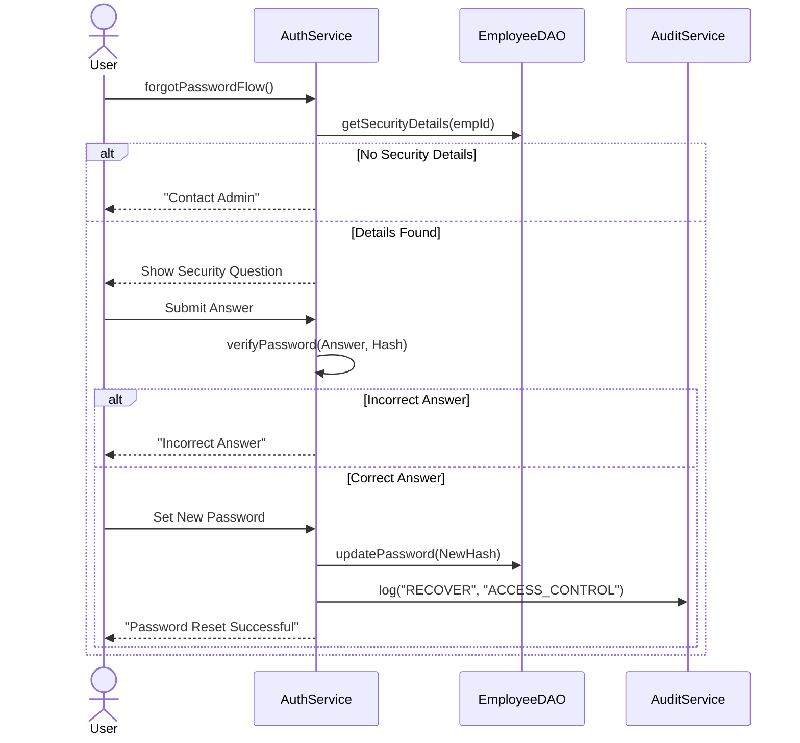

### 2.9 Profile Update Flow
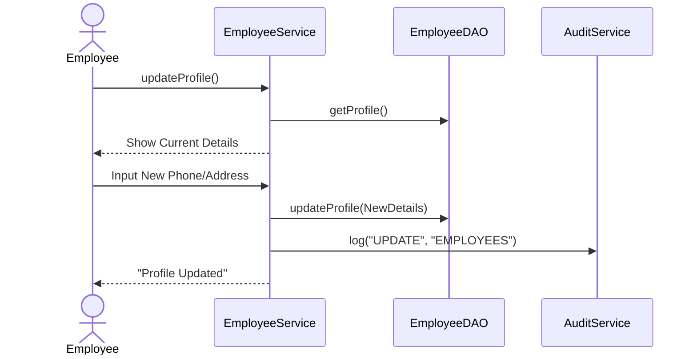

### 2.10 Goal Management Flow
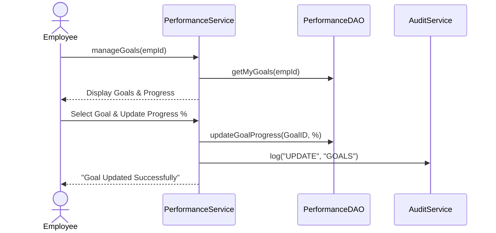

### 2.11 System Configuration Flow (Admin Generic)
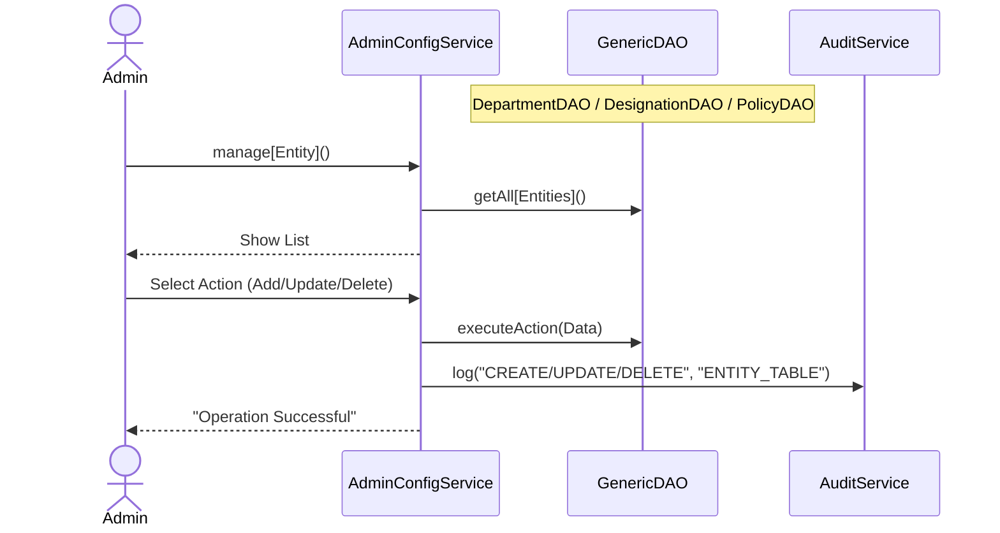

### 2.12 Manager Revoke Leave Flow
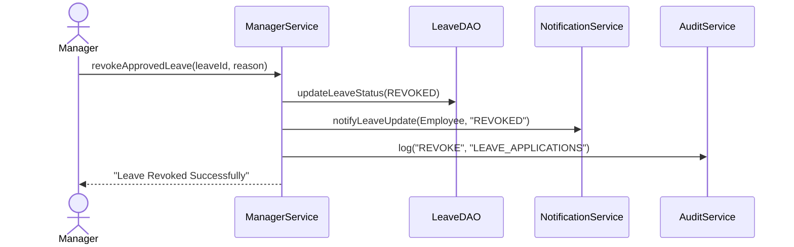

### 2.13 Admin Leave Quota Assignment Flow
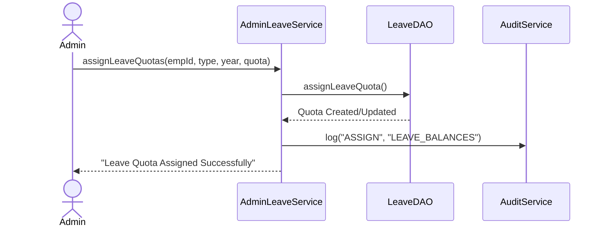
